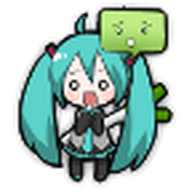
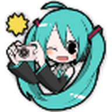
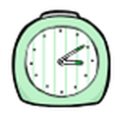
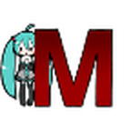
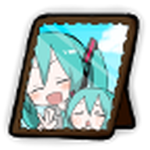
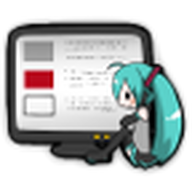
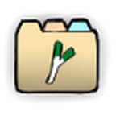

<div align="center">


# Hatsune Miku Icon Pack

A port of hyoromo's 2010-era Hatsune Miku launcher themes into a modern Android
icon pack that works on essentially any third-party launcher. No ads, no
telemetry, no permissions — just 28 icons and an `appfilter.xml`.

[](https://developer.android.com)
[](https://kotlinlang.org)
[](https://developer.android.com/compose)
[](LICENSE)
[](https://github.com/HatsyRei/hatsune-miku-icon-pack/releases)

**Package name:** `com.hatsyrei.mikuiconpack`

<table align="center">
<tr>
<td width="12.5%"><a href="app/src/main/res/drawable-nodpi/phone.png"></a></td>
<td width="12.5%"><a href="app/src/main/res/drawable-nodpi/messaging.png"></a></td>
<td width="12.5%"><a href="app/src/main/res/drawable-nodpi/browser.png"></a></td>
<td width="12.5%"><a href="app/src/main/res/drawable-nodpi/camera.png"></a></td>
<td width="12.5%"><a href="app/src/main/res/drawable-nodpi/music.png"></a></td>
<td width="12.5%"><a href="app/src/main/res/drawable-nodpi/maps.png"></a></td>
<td width="12.5%"><a href="app/src/main/res/drawable-nodpi/clock.png"></a></td>
<td width="12.5%"><a href="app/src/main/res/drawable-nodpi/settings.png"></a></td>
</tr>
<tr>
<td align="center"><sub><b>Phone</b></sub></td>
<td align="center"><sub><b>Messaging</b></sub></td>
<td align="center"><sub><b>Browser</b></sub></td>
<td align="center"><sub><b>Camera</b></sub></td>
<td align="center"><sub><b>Music</b></sub></td>
<td align="center"><sub><b>Maps</b></sub></td>
<td align="center"><sub><b>Clock</b></sub></td>
<td align="center"><sub><b>Settings</b></sub></td>
</tr>
<tr>
<td width="12.5%"><a href="app/src/main/res/drawable-nodpi/gmail.png"></a></td>
<td width="12.5%"><a href="app/src/main/res/drawable-nodpi/calendar.png"></a></td>
<td width="12.5%"><a href="app/src/main/res/drawable-nodpi/gallery.png"></a></td>
<td width="12.5%"><a href="app/src/main/res/drawable-nodpi/youtube.png"></a></td>
<td width="12.5%"><a href="app/src/main/res/drawable-nodpi/market.png"></a></td>
<td width="12.5%"><a href="app/src/main/res/drawable-nodpi/contacts.png"></a></td>
<td width="12.5%"><a href="app/src/main/res/drawable-nodpi/folder_open.png"></a></td>
<td width="12.5%"><a href="app/src/main/res/drawable-nodpi/allapp.png"></a></td>
</tr>
<tr>
<td align="center"><sub><b>Gmail</b></sub></td>
<td align="center"><sub><b>Calendar</b></sub></td>
<td align="center"><sub><b>Gallery</b></sub></td>
<td align="center"><sub><b>YouTube</b></sub></td>
<td align="center"><sub><b>Play Store</b></sub></td>
<td align="center"><sub><b>Contacts</b></sub></td>
<td align="center"><sub><b>Folder</b></sub></td>
<td align="center"><sub><b>App drawer</b></sub></td>
</tr>
</table>

<sub>Click any icon to view it full size — all 28 live in <a href="app/src/main/res/drawable-nodpi/"><code>drawable-nodpi/</code></a>.</sub>

</div>

---

## Credits

This project contains **none** of my original artwork. Everything visual here
belongs to the people below, and the port exists only because they made it first.

### Artwork — Niboshi (にぼし) / (あたたたP)

Every icon in this pack was drawn by **Niboshi**, a Japanese illustrator and PV
artist who was prolific in the VOCALOID scene around 2008–2011, creating art and
videos for producers including Lovely-P, Kuchibashi-P and u160. Their work is
credited on Niconico under both にぼし and あたたたP.

- Niconico: <https://www.nicovideo.jp/user/1044709>

The chibi Miku sprites, the leek-handled house, the folder art and the app drawer
furniture are all theirs. Please do not reuse these images outside the spirit of
the original themes.

### Original themes — hyoromo

**hyoromo** built and published the original launcher themes that these assets
were shipped in, and continues to publish Android apps today.

- GitHub: <https://github.com/hyoromo>
- Play Store developer page: <https://play.google.com/store/apps/dev?id=7087451883225614829>

The two themes this pack is derived from are both still on the Play Store:

| Theme | Package | Downloads | Rating |
| --- | --- | --- | --- |
| [GO Launcher EX Theme -Miku-](https://play.google.com/store/apps/details?id=jp.hyoromo.golauncherex.miku) | `jp.hyoromo.golauncherex.miku` | 500K+ | 3.8★ (337) |
| [ADW Theme -Miku Hatsune-](https://play.google.com/store/apps/details?id=jp.hyoromo.adwtheme.miku) | `jp.hyoromo.adwtheme.miku` | 100K+ | 4.1★ (142) |

Both were last updated in March 2015. If you are running GO Launcher or ADW,
install the originals instead — they are the real thing and they still work.

## Why this port exists

The original themes only work in GO Launcher and ADW Launcher, and the reason is
worth explaining because it is not obvious.

Those themes are a bag of PNGs named by **function**: `phone.png`, `browser.png`,
`gmail.png`, `folder_open.png`. They work because the launcher itself contained a
hardcoded lookup table — GO Launcher's code effectively said "when drawing the
dialer, load `phone.png` out of the theme package". A launcher that did not
implement GO's private naming convention had no idea what to do with the files,
and there was no way to theme an app that was not already on the launcher's list.

Around 2011 ADW introduced `appfilter.xml`, which inverts the relationship. Rather
than the launcher knowing about the pack, the **pack declares the mapping**:

```xml
<item component="ComponentInfo{com.google.android.dialer/com.google.android.dialer.extensions.GoogleDialtactsActivity}"
      drawable="phone" />
```

Nova, Apex, Action, Lawnchair, Niagara, Smart Launcher, Microsoft Launcher and
others all adopted that same format. It has never been an official part of
Android — it is a convention everyone copied. Universal compatibility comes down
to four things, all of which this pack implements:

1. **`res/xml/appfilter.xml`** — the component-to-drawable mapping.
2. **Manifest intent filters** — one per launcher dialect, so each launcher's
   icon pack picker can find the package at all.
3. **`res/xml/drawable.xml`** — a flat list of every drawable, which populates the
   launcher's manual icon picker.
4. **An activity that returns `Intent.ShortcutIconResource`** — so "long-press an
   app → Edit → tap the icon" can pull an icon out of the pack by hand.

## Package

| | |
| --- | --- |
| App name | Hatsune Miku Icon Pack |
| Package name / application ID | `com.hatsyrei.mikuiconpack` |
| Repository | <https://github.com/HatsyRei/hatsune-miku-icon-pack> |
| Min SDK | 23 (Android 6.0) |
| Permissions | none |

The package name is what a launcher's icon pack picker identifies the pack by,
and what `adb install`/`adb uninstall` take as an argument:

```bash
adb install app-release.apk
adb shell pm uninstall com.hatsyrei.mikuiconpack
```

## Contents

28 icons, all of them from the original themes:

- **20 app icons** — browser, calculator, calendar, camera, clock, contacts, email,
  facebook, gallery, gmail, gtalk, maps, market, messaging, music, phone, settings,
  twitter, voicesearch, youtube.
- **8 pieces of launcher furniture** — the app drawer button, app panel frames,
  folder art, drag targets and the leek house. Nothing consumes these
  automatically any more, but they are exposed in the picker so you can assign
  them by hand.

`appfilter.xml` deliberately stays close to what hyoromo's themes covered: each
icon is mapped to the app it was drawn for, plus that app's modern successors
(Android Market → Play Store, Google Talk → Hangouts → Google Chat, and so on).
It does not try to guess at hundreds of unrelated apps. Anything unmapped keeps
its stock icon, and you can always assign an icon by hand from the picker.

The five wallpapers that shipped with the ADW theme are kept in `art/` for
reference but are not bundled into the APK.

## Supported launchers

The manifest advertises twelve theme actions: ADW and ADWEx, Nova, Apex, GO
Launcher EX, LauncherPro, Atom, Lawnchair, Smart Launcher, Action Launcher, Sony
Xperia Home and Phonemetra Turbo. Launchers that read Nova's or ADW's action —
which is most of them, including Niagara and Kvaesitso — are covered too.

## Building

Requires JDK 21, an Android SDK with API 37 and ImageMagick.

```bash
./build.sh              # regenerate assets, then assemble a release APK
./build.sh debug        # debug APK
./build.sh install      # release APK, then adb install
```

Output lands in `app/build/outputs/apk/release/app-release.apk`. Release builds
are signed with the auto-generated debug key.

## How the assets are generated

Nothing under `app/src/main/res` is authored by hand. `build.sh` regenerates it
all from `art/miku-hyoromo/` before every build:

| Script | Output |
| --- | --- |
| `tools/upscale.sh` | `drawable-nodpi/*.png` — 144×144, Lanczos |
| `tools/gen_launcher_icon.sh` | `mipmap-*/ic_launcher.png` and the adaptive foreground |
| `tools/gen_drawable_xml.py` | `res/xml/drawable.xml` |

Only `appfilter.xml` is maintained by hand, since it encodes decisions rather
than file listings.

The originals are 72×72, and they are resampled to 144×144 — an exact 2×. An
integer factor resamples more cleanly than an awkward one, and 144 happens to be
what an xxhdpi (1080p) launcher asks for, so on the most common class of phone
nothing is scaled at run time at all. Doing the work offline with Lanczos also
beats letting the launcher stretch a 72px bitmap with bilinear filtering at draw
time. `drawable-nodpi` stops Android from scaling them a second time.

### One build-system trap

`isShrinkResources` is deliberately **off**. Nothing inside the APK references
these drawables — launchers resolve them by name, by reflection, from another
process — so the resource shrinker cheerfully deletes every single one. This is
a common way for icon packs to ship completely broken.

## Licensing

The MIT license in `LICENSE` covers the **code** in this repository: the Gradle
setup, the generator scripts, the XML plumbing and the Compose UI.

It does **not** cover the artwork. Those images are Niboshi's work, published as
part of hyoromo's themes, and depict Hatsune Miku — a character owned by Crypton
Future Media and governed by the [Piapro Character License](https://piapro.net/intl/en_for_creators.html).
Treat them accordingly: this is a fan port, not a redistribution license.
